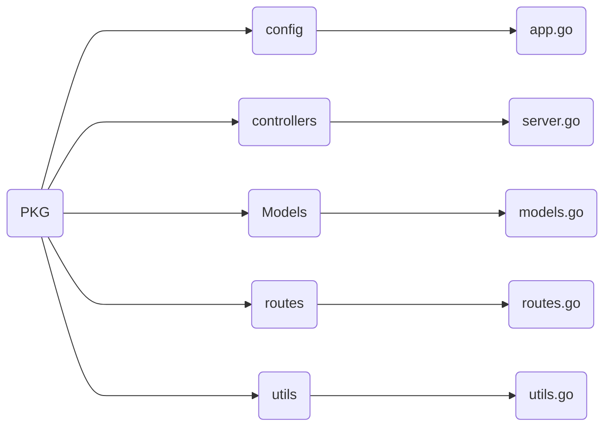

# Blog_post_server
====================================================================

## Authors

- [@dev-hack95](https://www.github.com/dev-hack95)

## Project Status
- Complete

## Table of Contents

  - [Tech Stack](#tech-stack)
  - [Flowchart](#flowchart)

## Tech Stack
  - Golang, Docker, Postgresql, Microservices

## Flowchart

